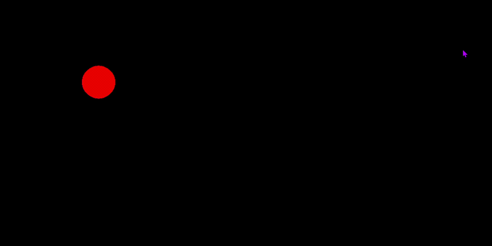
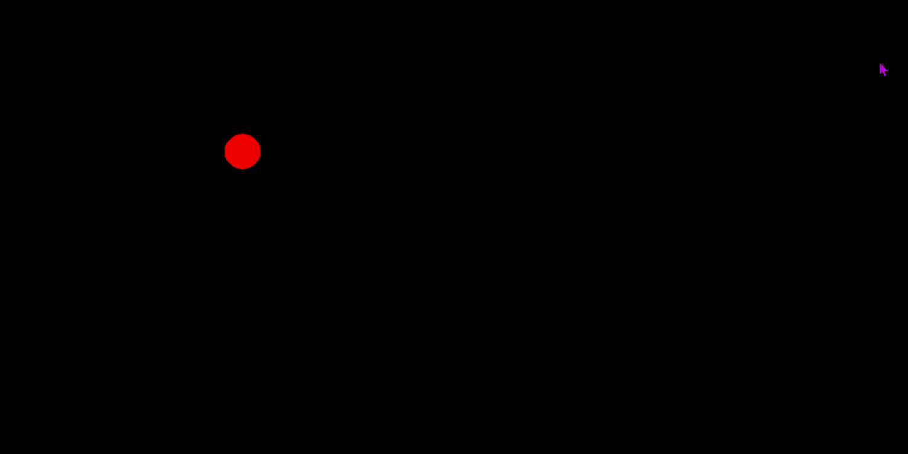

 #  Dino Boy


  This game is written in Haskell language with functional reactive design. The reactive framework
for the game I developed is based on book "Haskell School of Expression" by Paul Hudak and Conal Elliott
(https://www.amazon.com/Haskell-School-Expression-Functional-Programming/dp/0521644089)

For the graphics I used library SDL2 for haskell bindings.

## Design

Entire game logic is in file DinoBoyGame.hs. Folder Hudak contains the reactive game framework.

The components in the game are defined at the end of DinoBoyGame.hs as
```
game  = backGrd `over` boySprite `over` boxes `over` sounds `over` messages
```

* backGrd   - a moving background picture
* boySprite - the picture of boy who reacts by jumping when space key is pressed.
* boxes     - the objects moving from right to left at different speeds
* sounds    - sounds produced when boy hit a box
* mesages   - text messages on screen which are score and "you Died" message when hit.
* 
## Functional Reactive Framework for Graphics
Module GameEngine.hs and Fal.hs have the features(Behaviors) that user can use to build a game.
Here is the sample exmaple of using the framework:


1) Draw a red ellipse on screen at position (2,2) with radious r1 = 0.05 , r2 = 0.05


```
r1 = 0.05
r2 = 0.05
x  = 2.0
y  = 2.0
color = red
pic1 = paintedPicture  color (translate (x, y) (ell r1 r2) )
runReact "Reactive Game" pic1 resoures
```

'ell' draws an ellipse on screen. 'translate' moves ellipse at position (0, 0) to (2,2)
This picture will be a static at one place in red color. Now how to make it dynamic?

2) To animate ellipse by shrink and grow, try this


```
r1 = cos time
r2 = sin time
x  = 2.0
y  = 2.0
color = red
pic1 = paintedPicture color (translate (x, y) (ell r1 r2) )
runReact "Reactive Game" pic1 resoures
```

'time' is a behavior which represents current time in milli seconds. When we use
cosine of time, we will have values betiween 0 and 1, which will be used in each iteration of the animation.

3) Now to make more interesting, let us make the color of ellipse varying.
The color will be changing in every 1.0 seond.


```
twinkling = red `switch` ( timer 1.0 `withElem_` cycle[red, yellow, blue ])
r1 = cos time
r2 = sin time
x  = 2.0
y  = 2.0
color = twinkling
pic1 = paintedPicture color (translate (x, y) (ell r1 r2) )
runReact "Reactive Game" pic1 resoures
```

4) The same way we can make the color dynamic, we can have dynamic x and y positions, which enables the movement of ellipse.
To move the ellipse in circle, try this


```
r = sin time + 0.2
r1 = r
r2 = r
x = cos time
y = sin time
color = twinkling
pic1 = paintedPicture color (translate (x, y) (ell r1 r2) )
runReact "Reactive Game" pic1 resoures
```

Now we have a circling, shrink-growing and twinkling ellipse.

## Development System

```
Ubuntu 20.0 running on WSL2 Windows 10.
Visual Studio Code for coding
Xming for XWindow Server
Pulse Audio for Sound Server.
```
Thanks for visiting this page!. Hope you liked this framework!. For any questions, send to s.muttath.d@gmail.com

Shajen Muttath
