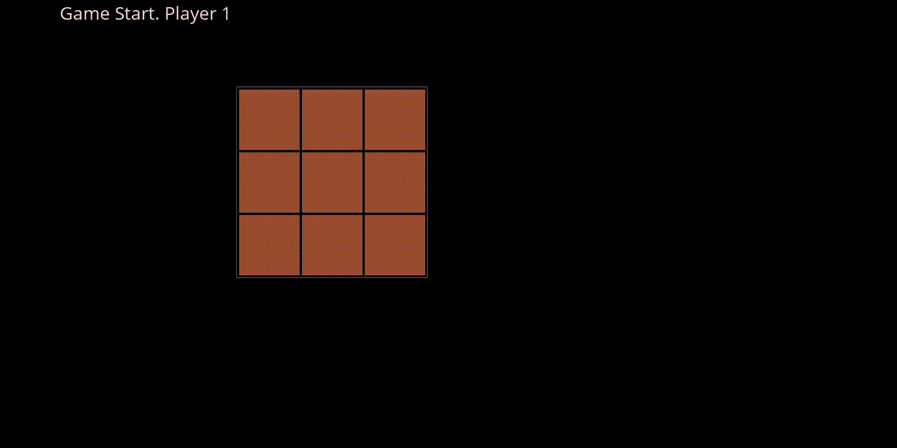

# Tic Tac Toe


  This game is written in Haskell language using functional reactive design.

## Design

The starting point of game is in file src/testTicTac.hs which contains the Graphical components using Functional Reactive Framework. The file src/TicTacToe.hs contains the pure part, which has core logic, of the TicTacToe game.

The TicTacToe board is made of list of 9 cells. Each cell has an id of values 0 to 8. Each cell can have three values 0, 1 or 2. These are the states of each cell.
```
0 - the initial unplayed state.
1 - the cell is played by player 1. 
2 - the cell is played by player 2. 
```
The cell id is used to access and update the cells on board.

In the Gui part, each cell is represented by a Gui Button. When user click left mouse button, the location is converted into cell id, which is used to update the board.
The the color of each square are reactive values from the values in the cells of the board. The values are converted in to 3 colores, 0-Brown, 1- Yellow and 2-Blue.

## Development System

```
Ubuntu 20.0 running on WSL2 Windows 10.
Visual Studio Code for coding
Xming for XWindow Server
Pulse Audio for Sound Server.
```

Thanks for visiting this page!. Hope you liked this framework!. For any questions, send to s.muttath.d@gmail.com

Shajen Muttath
