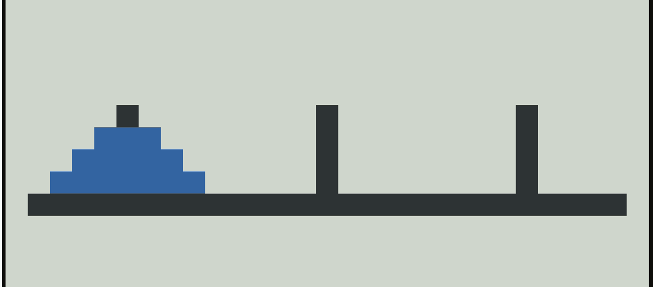

# Tower Of Hanoi

Animated solution to the Tower of Hanoi puzzle

This program is written in Haskell language.
The solution is wellknown recursive algorithm (https://en.wikipedia.org/wiki/Tower_of_Hanoi)
The animation is done using Haskell Bricks library.

# Design.

The recursive algorithm produces a list of steps to move the disks like 
[(0,0,2,1),(1,0,1,2),(0,2,1,0),(2,0,2,1),(0,1,0,2),(1,1,2,0),(0,0,2,1)]
This has the format ( disk-to-move, from-peg, to-peg, using-auxilary-peg  )
  
These steps are then converted to a list of animation commands understand by Bricks Animation.

The bricks animation understands basic commands (CUp, CLeft, CRight, CDown) to move the disks.
The animation command 'CLeft 0' means move the disk 0 towards left one step. 

The command processing and animation system run in different threads. The commands are send to the animation system using a channel.

